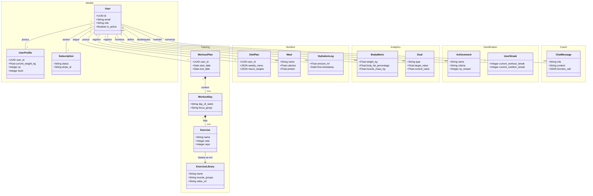

# Arquitetura Modular Monolith (DDD) - FitGen

Este diagrama ilustra a organização dos Bounded Contexts (Módulos) e as principais Entidades do sistema após a refatoração.

## Fluxo de Dependência

- **Núcleo (Core)**: `Training`, `Nutrition` e `Identity` são os pilares.
- **Suporte**: `Gamification` e `Analytics` observam os dados do núcleo para gerar valor (XP, Gráficos).
- **Interface**: `Coach` atua como uma interface conversacional que interage com todos os módulos via function calling.
