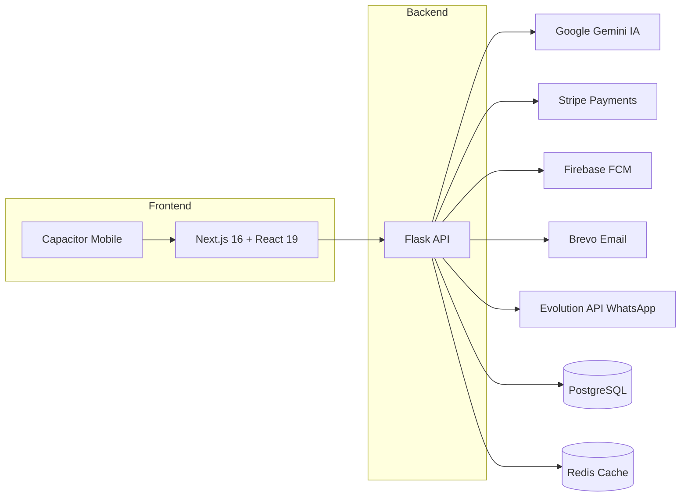

# Arquitetura Modular Monolith (DDD) - FitGen

Este diagrama ilustra a organização dos Bounded Contexts (Módulos) e as principais Entidades do sistema.

```mermaid
classDiagram
    direction TB

    %% Contexto: Identity
    namespace Identity {
        class User {
            +UUID id
            +String email
            +String role
            +Boolean is_active
            +DateTime deleted_at
            +DateTime last_login_at
        }
        class UserProfile {
            +UUID user_id
            +Float current_weight_kg
            +Integer xp
            +Integer level
            +Float bmr
            +Float tdee
        }
        class Subscription {
            +String status
            +String stripe_id
        }
        class AuditLog {
            +String action
            +JSON details
            +DateTime created_at
        }
    }

    %% Contexto: Training
    namespace Training {
        class WorkoutPlan {
            +UUID user_id
            +Date start_date
            +Date end_date
            +String status
        }
        class WorkoutDay {
            +String day_of_week
            +String focus_group
        }
        class Exercise {
            +String name
            +Integer sets
            +Integer reps
            +Integer rest_seconds
        }
        class ExerciseLibrary {
            +String name
            +String muscle_groups
            +String video_url
        }
        class WorkoutSession {
            +UUID user_id
            +Integer duration_minutes
            +Float calories_burned
            +Boolean completed
        }
        class ExerciseLog {
            +Integer set_number
            +Integer reps
            +Float weight_kg
        }
    }

    %% Contexto: Nutrition
    namespace Nutrition {
        class DietPlan {
            +UUID user_id
            +JSON weekly_menu
            +JSON macro_targets
            +JSON shopping_list
        }
        class DietPreference {
            +UUID user_id
            +JSON restrictions
            +String budget
            +String cooking_skill
        }
        class Meal {
            +String name
            +Float calories
            +Float protein
            +Float carbs
            +Float fat
            +Float fiber
        }
        class HydrationLog {
            +Float amount_ml
            +DateTime timestamp
        }
        class HydrationGoal {
            +Float daily_goal_ml
        }
    }

    %% Contexto: Analytics
    namespace Analytics {
        class BodyMetric {
            +Float weight_kg
            +Float body_fat_percentage
            +Float muscle_mass_kg
        }
        class Goal {
            +String type
            +Float target_value
            +Float current_value
        }
        class ProgressSnapshot {
            +String photo_url
            +DateTime created_at
        }
    }

    %% Contexto: Gamification
    namespace Gamification {
        class Achievement {
            +String name
            +String criteria
            +Integer xp_reward
        }
        class UserAchievement {
            +UUID user_id
            +UUID achievement_id
            +DateTime unlocked_at
        }
        class UserStreak {
            +Integer current_workout_streak
            +Integer current_nutrition_streak
            +Integer current_hydration_streak
        }
    }

    %% Contexto: Coach
    namespace Coach {
        class ChatMessage {
            +String role
            +String content
            +JSON function_call
        }
    }

    %% Contexto: Communication
    namespace Communication {
        class Notification {
            +String title
            +String message
            +Boolean is_read
        }
        class DeviceToken {
            +UUID user_id
            +String token
            +String platform
        }
        class Feedback {
            +String content
            +String status
        }
    }

    %% Relationships
    User "1" -- "1" UserProfile : possui
    User "1" -- "1" Subscription : assina
    User "1" -- "many" AuditLog : gera
    User "1" -- "1" WorkoutPlan : segue
    WorkoutPlan "1" *-- "many" WorkoutDay : contém
    WorkoutDay "1" *-- "many" Exercise : lista
    Exercise --> ExerciseLibrary : baseia-se em
    WorkoutSession --> WorkoutPlan : referencia
    WorkoutSession "1" *-- "many" ExerciseLog : registra

    User "1" -- "1" DietPlan : possui
    User "1" -- "1" DietPreference : configura
    User "1" -- "many" Meal : registra
    User "1" -- "many" HydrationLog : registra
    User "1" -- "1" HydrationGoal : define

    User "1" -- "many" BodyMetric : monitora
    User "1" -- "many" Goal : define
    User "1" -- "many" ProgressSnapshot : captura

    User "1" -- "1" UserStreak : mantém
    User "many" -- "many" Achievement : desbloqueia

    User "1" -- "many" ChatMessage : conversa

    User "1" -- "many" Notification : recebe
    User "1" -- "many" DeviceToken : registra
    User "1" -- "many" Feedback : envia
```

## Módulos (Bounded Contexts)

| Módulo | Responsabilidade |
|--------|-----------------|
| **Identity** | Usuários, autenticação (JWT), perfil, assinaturas (Stripe), auditoria |
| **Training** | Planos de treino, biblioteca de exercícios, sessões, logs de séries |
| **Nutrition** | Refeições, planos de dieta, preferências alimentares, hidratação |
| **Analytics** | Métricas corporais, metas, fotos de progresso |
| **Gamification** | XP, níveis, conquistas, streaks |
| **Coach** | Coach Virtual com IA (Gemini + function calling) |
| **Communication** | Notificações (push, web), email (Brevo), WhatsApp (Evolution API), feedback |

## Fluxo de Dependência

- **Núcleo (Core)**: `Identity`, `Training` e `Nutrition` são os pilares.
- **Suporte**: `Gamification` e `Analytics` observam os dados do núcleo para gerar valor (XP, gráficos, tendências).
- **Interface**: `Coach` atua como interface conversacional que interage com todos os módulos via function calling.
- **Infraestrutura**: `Communication` é transversal, enviando notificações e emails disparados por eventos dos demais módulos.

## Integrações Externas

